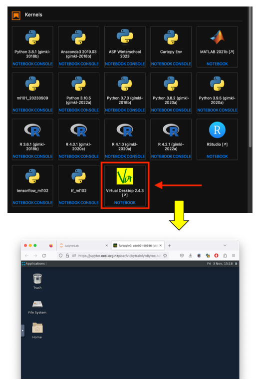
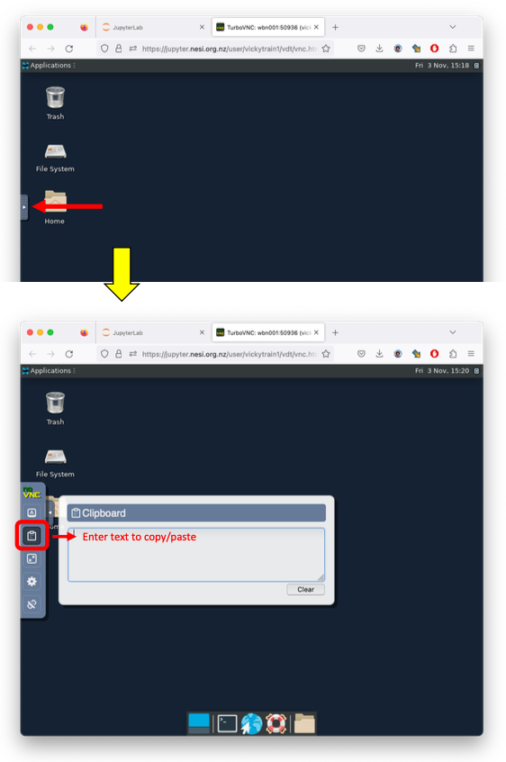

# Using the VDT

To use `mrview` we need to launch the virtual desktop. 

{width="800"}

To copy and paste from our Jupyter notebook into a VDT terminal window,you need to use the copy and paste function.

{width="800"}
